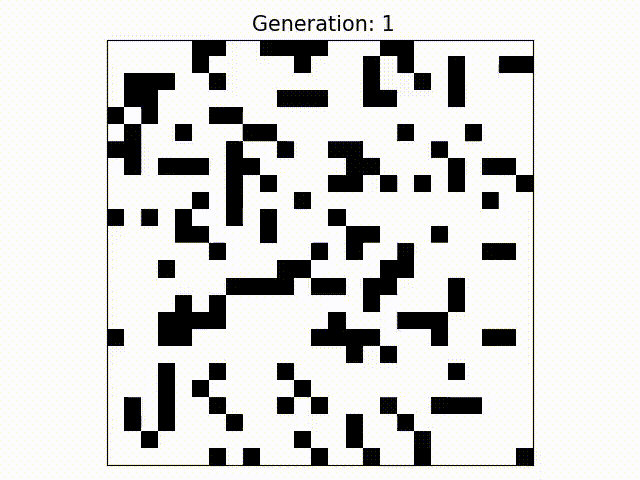

# Conway

### Introduction
---
This repository contains a simple implementation of Conway's Game of Life. The Game of Life uses a simple set of rules to evolve an initial board of 'cells' without further user input. This initial state takes the form of a 2D board with each element containing either a living "cell" or a dead "cell". [Higher dimensional](https://github.com/bruzewskis/HyperLife)  boards are also possible. 



## Rules
---
The board is updated according to the following rules based on the state of the surround neighbors for each living or dead cell: 

* A living cell will survive if it has two or three living neighbors
* A living cell with any other number of living neighbors will die 
* A cell is produced in place of a dead cell if there are exactly three living neighbors

For neighbors that lay outside the board, the code will "wrap around" and check the neighbor on the exact opposite side of the board. As noted previously, the implementation of the Game of Life in this repository is simple in that every cell, whether dead or alive, is checked for its neighbors every generation as the board evolves. This can be rather inefficient for large boards with lots of dead cells, and there are many potential ways to improve performance which will be explored in the future. 

For more details see the [Wikipedia](https://en.wikipedia.org/wiki/Conway%27s_Game_of_Life) entry.

## Installation
---

Simply clone the repository to your chosen directory using:

```bash
git clone https://github.com/PhamNguyen18/Conway.git
```

After setting up a game file (see the usage section), use `make` and run the executable. 


<<<<<<< HEAD
## Dependencies
---
* C++17 
* Python 3.6+ 
* Matplotlib 2.0+
* Numpy 1.20+

## Usage
---
The Game of Life can be played by creating an instance of the game in a separate file (see `conway.test.cpp` for an example). Since the board evolves on its own, the user only has direct control over the initial conditions of the game. A game can be initialized by specifying the number of rows, columns, and the total number of generations to evolve the board over or by importing from file. The example below creates a 20 by 20 board that will evolve over 500 generations:
=======
### Manual Setup
Since the board evolves on its own, the user only has direct control over the initial conditions of the game. A game can be initialized by specifying a board size and the total number of generations to evolve the board over or by importing from file. The example below creates a 20 by 20 board that will evolve over 500 generations:
>>>>>>> e2e2e3af36c4ab7e892666ec7fdcc49164361189

```C++
ConwayGameOfLife game(20, 20, 500); 
```

The board can be populated with randomly generated or user defined cells. The following will give each element on the board a 10% chance to generated a living cell:

```C++
game.populate(10);
```

A second argument can also be passed to seed the random number generator. 

To manually place cells, use the `set_cell` method. The following places a living cell (using the number 1) at the position (10, 10) on the board. 

```C++
game.set_cell(10, 10, 1);
```

A board can also be imported from file. The board row and column sizes are passed as parameters:

```C++
ConwayGameOfLife game(8, 9, 100);
game.import_from_file("light_spaceship.txt", 8, 9);
```
Note that the `game` instance requires the row and column sizes, too! See the provided text files in the repo for example boards.

Finally, the `print_delay` method can be used to specify the rate at which a board is printed to console in seconds. The following prints a board every 0.25s:

```C++
game.print_delay_ = 0.25;
```

## Visualization 
---
Games of life can be viewed in terminal by setting `print_to_console_` to `true` in your main game file. Dead cells are shown as 0's and living cells as 1's. More pleasing visuals can be created by using the provided `visualize.py` module. First, a file must be created that saves each generation of cells as the game evolves. This can be done by setting the following in your game file:

```C++
game.write_to_file();
```
This will generate a text file (default name is `game_out.txt`) that can be used by the module. An image of the initial board state can be made by simply running the module in the command line:

```
python visualize.py gameout.txt
```
Use `-h` for more details on the positional and optional arguments that can be used.

```
usage: visualize.py [-h] [-o {i,img,image,v,vid,video}] [-n NAME]
                    [-g GENERATION]
                    file

positional arguments:
  file                  Text file containing history of game

optional arguments:
  -h, --help            show this help message and exit
  -o {i,img,image,v,vid,video}, --output {i,img,image,v,vid,video}
                        Choose to save as image or video file
  -n NAME, --name NAME  File name for image/ video
  -g GENERATION, --generation GENERATION
                        Saves image of board at specified generation

```


## TODO:
---
* Enhance import file function to automatically detect row and column size of the board
* Restructure project files in repo
<<<<<<< HEAD
* Explore performance improvements (bit operations) 
=======
* Explore performance improvements (bit operations) 
>>>>>>> e2e2e3af36c4ab7e892666ec7fdcc49164361189
